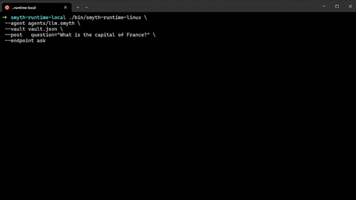

# What is SmythOS?

[SmythOS](https://smythos.com) is free software designed from the ground up to build AI agents with a visual drag & drop interface. <br>

We offer a free runtime for your agents on Mac, Windows & Linux, and a paid hosted service for serving your APIs and teams.

[](https://www.youtube.com/watch?v=E1ppbScXhGU)

SmythOS has been used by the US Airforce, companies like Toyota and Unilever and is actively used by over [7,000 developers](https://discord.gg/smythos).

# Smyth Runtime Local (SRE)

Smyth Runtime Local is a local version of the Smyth Runtime. You can use the executable to run, test and develop Smyth agents locally.
We release a Command Line Interface (CLI) version of our runtime.

- SRE is free for personal & commercial use.
- SRE is fully contained with no dependencies.
- SRE uses minimal resources (cpu, memory) and requires no GPU to run.

SRE enables the running of AI agents on your hardware, from raspberri pi to on prem cloud.

# Beta Limitations

Our first SRE release still has some limitations compared to our hosted SmythOS agents in the SmythOS Agent Cloud (SaaS).
For example, we don't yet support local models, and SRE does not provide a web server (API) to run your agents.
Even so, there are a million agents that you can now design and run locally, with total privacy and control over your data.

### Getting Started

To get started, clone the repository, copy the vault template and add your API keys to the vault.json file. The use the binary for your platform to run the agent.

```
git clone git@github.com:Smyth-ai/smyth-runtime-local.git
cp vault.json.example vault.json          # add API keys to vault.json

./bin/smyth-runtime-linux \
 --agent agents/llm.smyth \
 --vault vault.json \
 --post question="What is the capital of France?" \
 --endpoint ask
```

<p align="center">
  
</p>

You can also pass multiple parameters to the endpoint.

```
./bin/smyth-runtime-linux \
 --agent agents/llm.smyth \
 --vault vault.json \
 --post question="What is the capital of France?" user="John Doe" \
 --endpoint ask
```

### Video Tutorial

For a detailed walkthrough of how to use Smyth Runtime Local, check out our [tutorial video](https://youtu.be/RiNzFegoL-Y).

<p align="center">
  <a href="https://youtu.be/RiNzFegoL-Y">
    
  </a>
</p>

### CLI Arguments

| Argument             | Description                                                                                               |
| -------------------- | --------------------------------------------------------------------------------------------------------- |
| `--agent <file>`     | Path to `.smyth` agent file                                                                               |
| `--vault <file>`     | Path to the vault file                                                                                    |
| `--vault-key <file>` | Path to the pem file to decrypt `--vault`                                                                 |
| `--get [params...]`  | Make a GET call                                                                                           |
| `--post [params...]` | Make a POST call                                                                                          |
| `--endpoint <name>`  | Endpoint name                                                                                             |
| `--chat`             | Starts a local chat app for the agent, **Note that this cannot be used with --endpoint, --get or --post** |
| `-v, --version`      | Display version information                                                                               |
| `-d, --debug`        | Dump all args to the console                                                                              |
| `--help, -h`         | Show help message                                                                                         |

### Support

- [Discord](https://discord.gg/smythos)
- [Documentation](https://smythos.com/documentation/#/)
- [Academy & Certification](https://academy.smythos.com/)
- Email Support available for paid subscribers.
- Priority Support available for enterprise subscribers.

### FAQ

**1. What types of AI agents can I create with SmythOS? Are there any pre-built templates or examples?**

You can create virtually any type of AI agent, supporting any model, API, data source, or workflow. Our free template library offers a starting point for anyone. Sign up at [SmythOS.com](https://smythos.com) and access templates from the dashboard.

---

**2. How does the SmythOS runtime handle updates? Will I need to manually update my local SRE, or is there an automatic update process?**

Currently, there is no automatic updater.

---

**3. What kind of data privacy protections does Smyth Runtime Local offer when running agents on personal hardware?**

SRE does not communicate with our SaaS, ensuring complete control over your data and its flow.

---

**4. Are there any specific compatibility requirements for running Smyth Runtime Local on a Raspberry Pi or other low-power devices?**

SRE is highly lightweight, though we’re still gathering information on limitations. If you encounter any issues, please let us know!

---

**5. How can I troubleshoot common issues when setting up or running SmythOS agents locally? Is there a log file I can refer to?**

- **SRE:** No logs yet, but you can log the CLI output.
- **Agent Cloud:** Hosted agents in our SaaS have logs with a 30-day retention policy.

---

**6. Can I use third-party APIs with my SmythOS agents? If so, how do I integrate them?**

Yes, integration is straightforward. See this [documentation page](https://smythos.com/documentation/#/components/APICall). We also offer a [Postman integration](https://smythos.com/documentation/#/embodiments/postman?id=postman-integration).

---

**7. Does SmythOS support any form of scheduling or automated triggers to run agents at set times?**

- **SRE:** No scheduling yet, but you can run a CLI script.
- **Agent Cloud:** Hosted agents in our SaaS offer full scheduling capabilities with just a few clicks.

---

**8. If I want to deploy an agent created in SmythOS to the cloud later, what’s the migration process like?**

Simple—just hit "Deploy" in SmythOS Agent Studio and choose your hosting option.

---

**9. How do I manage version control for agents developed in SmythOS? Are there any best practices or built-in tools?**

SmythOS provides automated version control for agents in Agent Cloud. For SRE CLI, use Git or rename your agent versions to keep track.

---

**10. Are there any specific performance optimizations I should be aware of when running agents locally versus in the cloud?**

SRE CLI is designed to operate without our SaaS/cloud, so some features available in the cloud version may not be supported locally. SRE will notify you if a component or feature is unsupported.

---

**11. Are there any tutorials or examples on connecting SmythOS agents to machine learning models?**

Yes, check out this [documentation page](https://smythos.com/documentation/#/components/PromptGenerator). We also have guides for multimodal LLM, vision LLM, and LLM assistants. SmythOS Premium supports millions of Hugging Face models with drag-and-drop functionality, while SmythOS Enterprise supports custom fine-tuned models via Bedrock, Vertex, and more.

---

**12. How do I configure Smyth Runtime Local to communicate with a local database or other data sources?**

Set up API-based communication and use the API call component for integration.

---

**13. How do I export my agent from SmythOS?**

Press Control + Shift + E in the agent builder
